# 🏗️ Digital Twin - Complete Architectural Diagrams

This document contains all architectural diagrams for the Digital Twin project. Use these for LinkedIn posts, presentations, and documentation.

---

## 📊 Diagram 1: Complete System Architecture

```mermaid
graph TB
    subgraph "User Entry Points"
        WEB[🌐 Web Browser<br/>sajal-app.online]
        PHONE[📞 Phone Call<br/>+61 278 044 137]
        CLAUDE[🤖 Claude Desktop<br/>MCP Integration]
        API[🔌 REST API<br/>Programmatic Access]
    end

    subgraph "Frontend Layer - Next.js 15 + React 19"
        HOMEPAGE[Landing Page<br/>Three.js 3D Graphics<br/>GSAP Animations]
        CHAT[Chat Interface<br/>Real-time Streaming<br/>WebSocket]
        VOICE[Voice Interface<br/>Speech-to-Text<br/>Text-to-Speech]
        AUTH[Authentication<br/>NextAuth.js<br/>OAuth 2.0]
    end

    subgraph "Communication Layer"
        TWILIO[Twilio<br/>Phone System]
        DEEPGRAM[Deepgram Nova-3<br/>Speech-to-Text]
        CARTESIA[Cartesia<br/>Voice Cloning<br/>5+ Languages]
        OPENTTS[OpenAI TTS<br/>Alloy Voice<br/>Fallback]
        REALTIME[OpenAI Realtime API<br/>Low-Latency Voice]
    end

    subgraph "API Gateway & Session Management"
        ROUTER[Next.js API Routes<br/>Edge Functions]
        SESSION[Session Manager<br/>Upstash Redis<br/>24hr TTL]
        RATELIMIT[Rate Limiter<br/>50 req/hour/user]
        PII[PII Detection<br/>Data Sanitization]
    end

    subgraph "AI Orchestration Layer"
        LANGDETECT[Language Detection<br/>17+ Languages]
        QUERYROUTER[Query Router<br/>Complexity Analysis]
        CONTEXTMGR[Context Manager<br/>8K Token Window<br/>Smart Truncation]
        MCP_SERVER[MCP Server<br/>Model Context Protocol<br/>Claude Integration]
    end

    subgraph "RAG Pipeline"
        EMBEDDING[OpenAI Embeddings<br/>text-embedding-ada-002<br/>~50ms]
        HYBRIDSEARCH[Hybrid Search Engine]
        SEMANTIC[Semantic Search<br/>Vector Similarity]
        KEYWORD[Keyword Search<br/>BM25 Algorithm]
        VECTOR_DB[Upstash Vector DB<br/>Top 10 Candidates]
        RERANKER[Cross-Encoder<br/>Reranking<br/>Top 3 Results<br/>~80ms]
    end

    subgraph "Knowledge Base"
        POSTGRES[(Neon PostgreSQL<br/>Professional Profile<br/>Conversation History<br/>Analytics)]
        REDIS[(Upstash Redis<br/>Active Sessions<br/>Cache Layer)]
        PAYLOAD[Payload CMS 3.0<br/>Content Management<br/>TypeScript-first]
    end

    subgraph "AI Models - Intelligent Routing"
        GROQ[Groq AI<br/>Llama 3.1 70B<br/>Fast Inference<br/>~150ms<br/><br/>Use Cases:<br/>- Factual queries<br/>- Simple questions<br/>- Known topics]
        GPT4[OpenAI GPT-4<br/>Deep Reasoning<br/>~200ms<br/><br/>Use Cases:<br/>- Complex reasoning<br/>- Creative tasks<br/>- Nuanced questions]
    end

    subgraph "Response Processing"
        CITATION[Citation Engine<br/>Source Tracking]
        FORMATTER[Output Formatter<br/>Text/SSML/Rich Media]
        MULTILANG[Translation Layer<br/>17+ Languages]
        STREAMING[Response Streaming<br/>WebSocket/HTTP]
    end

    subgraph "Infrastructure & Monitoring"
        VERCEL[Vercel Edge<br/>Global CDN<br/>Edge Functions<br/>Serverless Deployment]
        ANALYTICS[Analytics<br/>Performance Monitoring<br/>Error Tracking]
    end

    %% User Entry Flows
    WEB --> HOMEPAGE
    WEB --> CHAT
    WEB --> VOICE
    PHONE --> TWILIO
    CLAUDE --> MCP_SERVER
    API --> ROUTER

    %% Frontend to Gateway
    HOMEPAGE --> AUTH
    CHAT --> ROUTER
    VOICE --> DEEPGRAM
    AUTH --> SESSION

    %% Voice Processing
    DEEPGRAM --> ROUTER
    TWILIO --> DEEPGRAM
    ROUTER --> CARTESIA
    ROUTER --> OPENTTS
    ROUTER --> REALTIME

    %% Gateway Processing
    ROUTER --> SESSION
    ROUTER --> RATELIMIT
    ROUTER --> PII
    SESSION --> REDIS
    PII --> LANGDETECT

    %% AI Orchestration
    LANGDETECT --> QUERYROUTER
    QUERYROUTER --> CONTEXTMGR
    CONTEXTMGR --> EMBEDDING
    MCP_SERVER --> QUERYROUTER

    %% RAG Pipeline
    EMBEDDING --> HYBRIDSEARCH
    HYBRIDSEARCH --> SEMANTIC
    HYBRIDSEARCH --> KEYWORD
    SEMANTIC --> VECTOR_DB
    KEYWORD --> VECTOR_DB
    VECTOR_DB --> RERANKER

    %% Knowledge Base Access
    RERANKER --> POSTGRES
    CONTEXTMGR --> POSTGRES
    CONTEXTMGR --> REDIS
    PAYLOAD --> POSTGRES

    %% Intelligent Model Routing
    RERANKER --> QUERYROUTER
    QUERYROUTER -->|Simple/Fast| GROQ
    QUERYROUTER -->|Complex/Deep| GPT4

    %% Response Processing
    GROQ --> CITATION
    GPT4 --> CITATION
    CITATION --> FORMATTER
    FORMATTER --> MULTILANG
    MULTILANG --> STREAMING

    %% Voice Output
    STREAMING --> CARTESIA
    STREAMING --> OPENTTS

    %% Back to User
    STREAMING --> CHAT
    CARTESIA --> VOICE
    CARTESIA --> TWILIO
    OPENTTS --> VOICE
    STREAMING --> MCP_SERVER

    %% Infrastructure
    VERCEL -.->|Hosts| ROUTER
    VERCEL -.->|Deploys| HOMEPAGE
    VERCEL -.->|Manages| PAYLOAD
    ANALYTICS -.->|Monitors| ROUTER
    ANALYTICS -.->|Tracks| GROQ
    ANALYTICS -.->|Tracks| GPT4

    style WEB fill:#4A90E2
    style PHONE fill:#4A90E2
    style CLAUDE fill:#4A90E2
    style API fill:#4A90E2
    style GROQ fill:#FF6B6B
    style GPT4 fill:#FF6B6B
    style VECTOR_DB fill:#F39C12
    style POSTGRES fill:#27AE60
    style REDIS fill:#E74C3C
    style VERCEL fill:#000000,color:#FFFFFF
    style MCP_SERVER fill:#9B59B6,color:#FFFFFF
```



**📸 To create a downloadable image:**
1. Copy the mermaid code above
2. Go to https://mermaid.live
3. Paste the code
4. Click "Actions" → "Download PNG" or "Download SVG"
5. Use in LinkedIn carousel slide

---

## 🔄 Diagram 2: Sequential Flow (Query Processing)

```mermaid
sequenceDiagram
    participant User as 👤 User
    participant Frontend as 🌐 Frontend<br/>(Next.js 15)
    participant Gateway as 🚪 API Gateway<br/>(Edge Functions)
    participant Session as 💾 Session Manager<br/>(Redis)
    participant AI as 🤖 AI Orchestrator
    participant RAG as 🔍 RAG Pipeline
    participant Vector as 📊 Vector DB<br/>(Upstash)
    participant KB as 📚 Knowledge Base<br/>(PostgreSQL)
    participant Router as 🎯 Model Router
    participant Groq as ⚡ Groq<br/>(Llama 3.1 70B)
    participant GPT4 as 🧠 GPT-4
    participant Voice as 🎙️ Voice Cloning<br/>(Cartesia)

    User->>Frontend: 1. Send Query<br/>(Text/Voice/Phone/MCP)
    
    alt Voice Input
        Frontend->>Voice: 2a. Convert Speech-to-Text<br/>(Deepgram Nova-3)
        Voice-->>Frontend: Transcribed Text
    end
    
    Frontend->>Gateway: 3. HTTP/WebSocket Request
    Gateway->>Gateway: 4. Rate Limiting (50/hr)
    Gateway->>Gateway: 5. PII Detection & Sanitization
    
    Gateway->>Session: 6. Retrieve/Create Session
    Session->>Session: 7. Load Context from Redis<br/>(24hr TTL)
    Session-->>Gateway: Session Data + History
    
    Gateway->>AI: 8. Process Query
    AI->>AI: 9. Language Detection<br/>(17+ languages)
    AI->>AI: 10. Analyze Query Complexity
    
    AI->>RAG: 11. Execute RAG Pipeline
    RAG->>RAG: 12. Generate Embeddings<br/>(OpenAI ada-002, ~50ms)
    
    par Hybrid Search
        RAG->>Vector: 13a. Semantic Search<br/>(Vector Similarity)
        RAG->>KB: 13b. Keyword Search<br/>(BM25 Algorithm)
    end
    
    Vector-->>RAG: Top 10 Semantic Results
    KB-->>RAG: Top 10 Keyword Results
    
    RAG->>RAG: 14. Cross-Encoder Reranking<br/>(~80ms, Top 3)
    RAG->>KB: 15. Fetch Full Context<br/>+ Citations
    KB-->>RAG: Relevant Documents
    
    RAG-->>AI: 16. Return RAG Context<br/>(Top 3 + Citations)
    
    AI->>Router: 17. Route to Model
    
    alt Simple/Fast Query
        Router->>Groq: 18a. Send to Groq<br/>(~150ms inference)
        Groq-->>Router: Response
    else Complex/Deep Query
        Router->>GPT4: 18b. Send to GPT-4<br/>(~200ms inference)
        GPT4-->>Router: Response
    end
    
    Router->>Router: 19. Add Citations<br/>& Source Tracking
    Router->>Router: 20. Format Output<br/>(Text/SSML/Rich)
    
    alt Multilingual Response
        Router->>Router: 21. Translate Response<br/>(17+ languages)
    end
    
    Router-->>Gateway: 22. Final Response
    
    Gateway->>Session: 23. Save to Redis<br/>+ PostgreSQL
    Session-->>Gateway: Saved
    
    alt Voice Output Requested
        Gateway->>Voice: 24a. Generate Voice<br/>(Cartesia, 5+ languages)
        Voice-->>Gateway: Audio Stream
    end
    
    Gateway->>Frontend: 25. Stream Response<br/>(WebSocket/HTTP)
    Frontend->>User: 26. Display/Play Response
    
    Note over User,Voice: Total Pipeline: ~380ms<br/>Embedding: 50ms | Vector Search: 100ms<br/>Reranking: 80ms | LLM: 150ms
```



**📸 To create a downloadable image:**
1. Copy the mermaid code above
2. Go to https://mermaid.live
3. Paste the code
4. Click "Actions" → "Download PNG" or "Download SVG"
5. Perfect for technical documentation or presentations

---

## 💾 Diagram 3: Data Flow & 3-Tier Memory Architecture

```mermaid
graph LR
    subgraph "Data Sources"
        PROFILE[👤 Professional Profile<br/>mytwin.json<br/>professional-profile.md]
        PROJECTS[💼 Projects Data<br/>projects.ts]
        SKILLS[⚙️ Skills Data<br/>skills.ts]
        CMS[📝 Payload CMS<br/>Dynamic Content]
    end

    subgraph "Data Processing Pipeline"
        CHUNKING[📄 Content Chunking<br/>Semantic Splitting<br/>1000-2000 tokens]
        EMBEDDING_GEN[🔢 Embedding Generation<br/>OpenAI ada-002<br/>1536 dimensions]
        METADATA[🏷️ Metadata Extraction<br/>Categories<br/>Tags<br/>Timestamps]
    end

    subgraph "3-Tier Memory Architecture"
        subgraph "Tier 1: Hot Cache"
            REDIS_CACHE[⚡ Redis Cache<br/>Upstash Redis<br/><br/>- Active Sessions<br/>- Recent Queries<br/>- Rate Limits<br/>- Temp Context<br/><br/>TTL: 24 hours]
        end
        
        subgraph "Tier 2: Vector Store"
            VECTOR_STORE[🎯 Vector Database<br/>Upstash Vector<br/><br/>- Embeddings (1536D)<br/>- Semantic Search<br/>- Cosine Similarity<br/>- Hybrid Retrieval<br/><br/>Persistent]
        end
        
        subgraph "Tier 3: Cold Storage"
            POSTGRES_DB[💾 PostgreSQL<br/>Neon Serverless<br/><br/>- Full Conversations<br/>- User Profiles<br/>- Analytics Data<br/>- Audit Logs<br/>- Knowledge Base<br/><br/>Permanent]
        end
    end

    subgraph "Query Processing"
        USER_QUERY[❓ User Query]
        LANG_CHECK[🌍 Language Check<br/>17+ Languages]
        COMPLEXITY[⚖️ Complexity Analysis<br/>Simple vs Complex]
        EMBED_QUERY[🔢 Query Embedding]
    end

    subgraph "Retrieval Strategy"
        HYBRID[🔀 Hybrid Search]
        SEMANTIC_S[📊 Semantic<br/>Vector Similarity<br/>Cosine Distance]
        KEYWORD_S[🔤 Keyword<br/>BM25 Algorithm<br/>TF-IDF]
        COMBINE[➕ Combine Results<br/>Top 10 Each]
        RERANK[🎯 Cross-Encoder<br/>Reranking<br/>Top 3 Final]
    end

    subgraph "Model Selection & Response"
        DECISION{Query Type?}
        GROQ_MODEL[⚡ Groq<br/>Llama 3.1 70B<br/>Fast & Efficient]
        GPT4_MODEL[🧠 GPT-4<br/>Deep Reasoning]
        RESPONSE_GEN[💬 Response Generation<br/>+ Citations<br/>+ Sources]
    end

    subgraph "Output Processing"
        FORMAT_CHECK{Output Type?}
        TEXT_OUT[📝 Text Response<br/>Markdown<br/>JSON]
        VOICE_OUT[🎙️ Voice Response<br/>Cartesia Cloning<br/>5+ Languages]
        SSML_OUT[🗣️ SSML<br/>Phone System<br/>Twilio]
    end

    subgraph "Storage & Analytics"
        SAVE_CONV[💾 Save Conversation<br/>PostgreSQL]
        UPDATE_CACHE[⚡ Update Cache<br/>Redis]
        LOG_METRICS[📊 Log Metrics<br/>Performance<br/>Accuracy<br/>Usage]
    end

    %% Data ingestion flow
    PROFILE --> CHUNKING
    PROJECTS --> CHUNKING
    SKILLS --> CHUNKING
    CMS --> CHUNKING
    
    CHUNKING --> EMBEDDING_GEN
    CHUNKING --> METADATA
    
    EMBEDDING_GEN --> VECTOR_STORE
    METADATA --> POSTGRES_DB

    %% Query flow
    USER_QUERY --> LANG_CHECK
    LANG_CHECK --> COMPLEXITY
    COMPLEXITY --> EMBED_QUERY
    
    %% Search strategy
    EMBED_QUERY --> HYBRID
    HYBRID --> SEMANTIC_S
    HYBRID --> KEYWORD_S
    
    SEMANTIC_S --> VECTOR_STORE
    KEYWORD_S --> POSTGRES_DB
    
    VECTOR_STORE --> COMBINE
    POSTGRES_DB --> COMBINE
    COMBINE --> RERANK
    
    %% Context from memory
    COMPLEXITY --> REDIS_CACHE
    REDIS_CACHE -.->|Recent Context| DECISION
    
    %% Model routing
    RERANK --> DECISION
    DECISION -->|Simple/Fast| GROQ_MODEL
    DECISION -->|Complex/Deep| GPT4_MODEL
    
    GROQ_MODEL --> RESPONSE_GEN
    GPT4_MODEL --> RESPONSE_GEN
    
    %% Output formatting
    RESPONSE_GEN --> FORMAT_CHECK
    FORMAT_CHECK -->|Text/Chat| TEXT_OUT
    FORMAT_CHECK -->|Voice/Real-time| VOICE_OUT
    FORMAT_CHECK -->|Phone Call| SSML_OUT
    
    %% Storage
    RESPONSE_GEN --> SAVE_CONV
    RESPONSE_GEN --> UPDATE_CACHE
    RESPONSE_GEN --> LOG_METRICS
    
    SAVE_CONV --> POSTGRES_DB
    UPDATE_CACHE --> REDIS_CACHE
    LOG_METRICS --> POSTGRES_DB

    style REDIS_CACHE fill:#E74C3C,color:#FFF
    style VECTOR_STORE fill:#F39C12,color:#FFF
    style POSTGRES_DB fill:#27AE60,color:#FFF
    style GROQ_MODEL fill:#FF6B6B,color:#FFF
    style GPT4_MODEL fill:#FF6B6B,color:#FFF
    style USER_QUERY fill:#4A90E2,color:#FFF
    style RESPONSE_GEN fill:#9B59B6,color:#FFF
```

**📸 To create a downloadable image:**
1. Copy the mermaid code above
2. Go to https://mermaid.live
3. Paste the code
4. Click "Actions" → "Download PNG" or "Download SVG"
5. Great for explaining the data architecture

---

## 🎨 How to Create High-Quality Images for LinkedIn

### **Method 1: Mermaid Live Editor (Recommended)**
1. Visit https://mermaid.live
2. Paste any of the diagram codes above
3. Adjust theme if needed (dark/light)
4. Click "Actions" → "Download PNG" (for LinkedIn) or "Download SVG" (for presentations)
5. Use 1200x1200px or larger for best quality

### **Method 2: Screenshot Tools**
1. Render the diagram in VS Code (with Mermaid extension)
2. Use high-quality screenshot tool:
   - Mac: Cmd+Shift+4 (native) or CleanShot X
   - Windows: Snipping Tool or ShareX
3. Ensure high DPI/resolution

### **Method 3: Design Tools (Best Quality)**
1. Export SVG from Mermaid Live
2. Import into:
   - **Figma** (free, web-based)
   - **Canva** (add to carousel design)
   - **Adobe Illustrator** (professional)
3. Add branding, colors, annotations
4. Export as PNG (300 DPI) for LinkedIn

---

## 📊 LinkedIn Carousel Slide Suggestions

### **Slide 1: Cover**
- Title: "AI Digital Twin Architecture"
- Subtitle: "27+ Technologies | Production-Ready | Real-Time AI"
- Your photo or website screenshot

### **Slide 2: System Overview**
- Use Diagram 1 (Complete System Architecture)
- Highlight: "4 Entry Points | 27+ Technologies | <300ms Response"

### **Slide 3: Query Flow**
- Use Diagram 2 (Sequential Flow)
- Highlight: "26-Step Pipeline | 380ms Total | Intelligent Routing"

### **Slide 4: Memory Architecture**
- Use Diagram 3 (Data Flow)
- Highlight: "3-Tier System | Redis + Vector DB + PostgreSQL"

### **Slide 5: AI Intelligence**
- Focus on RAG pipeline section
- Text: "95%+ Accuracy | Hybrid Search | Cross-Encoder Reranking"

### **Slide 6: Tech Stack**
- List all 27+ technologies with logos
- Grouped by category

### **Slide 7: By The Numbers**
- 2 months | 20K lines | 27+ techs
- 99.9% uptime | <300ms latency
- $50/month operating cost

### **Slide 8: Demo Screenshots**
- Your actual website
- Chat interface
- Voice feature

### **Slide 9: Call to Action**
- Your contact info
- Links to website, GitHub, LinkedIn
- "I'm actively seeking roles"

---

## 🎯 Usage Tips

### **For LinkedIn Posts:**
- Use PNG format (1080x1080px or 1200x1200px)
- Keep text readable on mobile
- Use high contrast colors
- Add your branding/watermark

### **For GitHub README:**
- Use Mermaid code directly (GitHub renders it)
- Or link to SVG files in `/docs` folder
- Add explanatory text around diagrams

### **For Presentations:**
- Use SVG format (scales infinitely)
- Export to PowerPoint/Keynote
- Animate step-by-step reveals

### **For Documentation:**
- Keep Mermaid code in markdown files
- Renders in most modern tools
- Easy to update and version control

---

## 🚀 Quick Links

- **Mermaid Live Editor:** https://mermaid.live
- **Mermaid Documentation:** https://mermaid.js.org
- **Figma (Free):** https://figma.com
- **Canva (Free):** https://canva.com
- **LinkedIn Image Specs:** 1200x1200px (1:1) or 1200x628px (1.91:1)

---

## 📝 Notes

- All diagrams are production-accurate representations
- Technologies and flow match actual implementation
- Performance metrics are real measurements
- Update this file as architecture evolves

**Last Updated:** October 29, 2025
**Author:** Sajal Basnet
**Project:** Digital Twin - AI-Powered Professional Assistant
