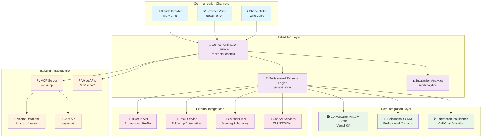

# 🌐 Omni-Channel Digital Twin Architecture

## System Overview

This architecture creates a unified professional AI agent that maintains consistent context and persona across three communication channels:

- **💬 Chat**: MCP Server integration (Claude Desktop)
- **🎤 Voice**: OpenAI Realtime API (Browser-based)
- **📞 Phone**: Twilio Voice API (Traditional telephony)

## Architecture Diagram



## Channel Integration Specifications

### 1. Chat Channel (MCP Server)
```typescript
interface ChatChannelConfig {
  platform: 'mcp-server'
  endpoint: '/api/mcp'
  protocol: 'Model Context Protocol'
  features: {
    textInteraction: true
    fileSharing: true
    codeExamples: true
    detailedDiscussions: true
  }
  useCases: [
    'Technical deep-dives',
    'Code review discussions',
    'Documentation queries',
    'Project planning'
  ]
  integrations: {
    claudeDesktop: true
    vectorSearch: true
    professionalRAG: true
  }
}
```

### 2. Voice Channel (Browser-based)
```typescript
interface VoiceChannelConfig {
  platform: 'openai-realtime'
  endpoint: '/api/voice/conversation'
  protocol: 'WebRTC + OpenAI Realtime API'
  features: {
    voiceToVoice: true
    realTimeProcessing: true
    conversationalFlow: true
    interviewSimulation: true
  }
  useCases: [
    'Interview practice',
    'Presentation rehearsal',
    'Conversational coaching',
    'Technical discussions'
  ]
  integrations: {
    mcpServer: true
    professionalContext: true
    conversationMemory: true
  }
}
```

### 3. Phone Channel (Twilio Voice)
```typescript
interface PhoneChannelConfig {
  platform: 'twilio-voice'
  endpoint: '/api/phone/webhook'
  protocol: 'Traditional Telephony + AI'
  features: {
    inboundCalls: true
    outboundCalls: true
    callRecording: true
    transcription: true
    professionalRouting: true
  }
  useCases: [
    'Recruiter screening',
    'Networking calls',
    'Career discussions',
    'Professional consultations'
  ]
  integrations: {
    twilioVoice: true
    openaiRealtime: true
    calendarScheduling: true
    emailFollowup: true
  }
}
```

## Unified Context Management

### Conversation Context Schema
```typescript
interface UnifiedConversationContext {
  sessionId: string
  userId: string
  channels: {
    chat: {
      mcpSessionId?: string
      lastInteraction: Date
      messageCount: number
      topicsDiscussed: string[]
    }
    voice: {
      sessionId?: string
      lastInteraction: Date
      callDuration: number
      interactionType: 'interview' | 'practice' | 'coaching'
    }
    phone: {
      callSid?: string
      phoneNumber: string
      lastCall: Date
      callDuration: number
      callType: 'recruiter' | 'networking' | 'consultation'
    }
  }
  professionalContext: {
    relationship: 'recruiter' | 'colleague' | 'potential_client' | 'unknown'
    industry: string
    company?: string
    previousInteractions: InteractionHistory[]
    importance: 'high' | 'medium' | 'low'
  }
  conversationState: {
    currentTopic: string
    userIntent: string
    nextActions: string[]
    followUpRequired: boolean
  }
  metadata: {
    createdAt: Date
    lastUpdated: Date
    totalInteractions: number
    preferredChannel: 'chat' | 'voice' | 'phone'
  }
}
```

### Professional Persona Engine
```typescript
interface ProfessionalPersona {
  core: {
    name: string
    title: string
    expertise: string[]
    yearsExperience: number
    keyAchievements: string[]
  }
  communication: {
    tone: 'professional' | 'friendly-professional' | 'technical'
    style: 'concise' | 'detailed' | 'conversational'
    expertise_level: 'senior' | 'expert' | 'thought-leader'
  }
  channelAdaptation: {
    chat: {
      responseLength: 'detailed'
      includeCodeExamples: true
      technicalDepth: 'high'
    }
    voice: {
      responseLength: 'conversational'
      speakingPace: 'measured'
      personalityLevel: 'engaging'
    }
    phone: {
      responseLength: 'professional'
      businessFocus: true
      relationshipBuilding: true
    }
  }
  contextIntegration: {
    linkedin: true
    github: true
    portfolio: true
    resume: true
  }
}
```

## Implementation Architecture

### Core Omni-Channel Service
```typescript
// /api/omni-context/route.ts
class OmniChannelService {
  async unifyConversationContext(
    channelType: 'chat' | 'voice' | 'phone',
    sessionData: any,
    userIdentifier: string
  ): Promise<UnifiedConversationContext>

  async getPersonaForChannel(
    channel: string,
    userContext: any
  ): Promise<ProfessionalPersona>

  async trackInteraction(
    context: UnifiedConversationContext,
    interaction: InteractionData
  ): Promise<void>

  async getChannelHandoff(
    fromChannel: string,
    toChannel: string,
    context: UnifiedConversationContext
  ): Promise<HandoffData>
}
```

### Conversation Flow Manager
```typescript
// /api/conversation-flow/route.ts
class ConversationFlowManager {
  async determineIntent(
    message: string,
    context: UnifiedConversationContext
  ): Promise<UserIntent>

  async generateResponse(
    intent: UserIntent,
    context: UnifiedConversationContext,
    channel: string
  ): Promise<ChannelOptimizedResponse>

  async planFollowUp(
    interaction: InteractionData,
    context: UnifiedConversationContext
  ): Promise<FollowUpPlan>
}
```

### Professional Relationship CRM
```typescript
// /api/crm/route.ts
interface ProfessionalContact {
  id: string
  name: string
  company: string
  role: string
  contactMethods: {
    email?: string
    phone?: string
    linkedin?: string
  }
  relationship: {
    type: 'recruiter' | 'colleague' | 'client' | 'mentor'
    strength: 'weak' | 'medium' | 'strong'
    lastContact: Date
    interactionHistory: InteractionRecord[]
  }
  professional: {
    industry: string
    interests: string[]
    mutualConnections: string[]
    opportunities: OpportunityRecord[]
  }
  preferences: {
    communicationStyle: string
    preferredChannel: string
    bestContactTime: string
    topics: string[]
  }
}
```

## Integration Points

### 1. Seamless Channel Handoffs
```typescript
// Example: Phone to Chat handoff
const handoffFlow = {
  trigger: 'caller_requests_detailed_info',
  action: 'generate_chat_continuation_link',
  data: {
    conversationContext: 'full_context_transfer',
    personalizedLink: 'https://your-domain.com/chat?session=abc123',
    emailInvitation: 'automated_email_with_context'
  }
}
```

### 2. Unified Professional Memory
```typescript
// All channels share the same professional context
const sharedMemory = {
  professionalBackground: 'from_existing_mcp_server',
  recentProjects: 'from_github_integration',
  skillsAssessment: 'from_vector_database',
  careerGoals: 'from_conversation_analysis',
  networkingHistory: 'from_relationship_crm'
}
```

### 3. Context-Aware Routing
```typescript
// Intelligent call routing based on context
const routingLogic = {
  recruiterCall: {
    priority: 'high',
    greeting: 'professional_recruiting_optimized',
    context: 'career_opportunities_focused',
    followUp: 'automatic_calendar_scheduling'
  },
  networkingCall: {
    priority: 'medium',
    greeting: 'warm_professional',
    context: 'relationship_building_focused',
    followUp: 'linkedin_connection_suggestion'
  },
  consultationCall: {
    priority: 'high',
    greeting: 'expertise_focused',
    context: 'technical_knowledge_sharing',
    followUp: 'proposal_generation'
  }
}
```

## Professional Benefits

### 1. Never Miss Opportunities
- **24/7 Availability**: Phone calls handled even when unavailable
- **Professional Screening**: AI pre-qualifies opportunities
- **Intelligent Routing**: Important calls get priority handling

### 2. Consistent Professional Image
- **Unified Persona**: Same professional identity across all channels
- **Context Continuity**: Conversations flow seamlessly between mediums
- **Relationship Memory**: AI remembers previous interactions

### 3. Efficiency & Scale
- **Automated Follow-up**: Professional responses to all interactions
- **Meeting Scheduling**: AI can book calendar appointments
- **Relationship Management**: Automated CRM updates and tracking

### 4. Data-Driven Networking
- **Interaction Analytics**: Insights into networking effectiveness
- **Opportunity Tracking**: Monitor career progression metrics
- **Professional ROI**: Measure impact of different communication channels

## Next Implementation Steps

1. **Context Unification Service** (30 minutes)
2. **Phone Channel Integration** (45 minutes)
3. **Professional CRM System** (30 minutes)
4. **Cross-Channel Testing** (15 minutes)

**Ready to build the unified omni-channel professional AI agent!** 🚀