# 🎯 Digital Twin - Presentation Architecture

**Simplified, high-level architecture perfect for presentations, LinkedIn, and interviews.**

---

## 📊 Complete System Architecture (Presentation Version)


---

## 🔄 Request Flow (Simple Version)

```mermaid
sequenceDiagram
    autonumber
    participant User as 👤 User
    participant Web as 🌐 Frontend
    participant API as 🚪 API Gateway
    participant AI as 🤖 AI Engine
    participant RAG as 🔍 RAG System
    participant DB as 💾 Database
    participant Model as 🧠 LLM

    User->>Web: Send Query
    Web->>API: Forward Request
    API->>API: Rate Limit + Security
    API->>AI: Process Query
    AI->>AI: Detect Language (17+)
    AI->>RAG: Retrieve Context
    RAG->>DB: Hybrid Search
    DB-->>RAG: Relevant Data
    RAG->>RAG: Rerank (Top 3)
    RAG-->>AI: Context + Citations
    AI->>Model: Groq or GPT-4
    Model-->>AI: Generate Response
    AI-->>API: Formatted Output
    API-->>Web: Stream Response
    Web-->>User: Display Result
    
    Note over User,Model: Total: ~380ms<br/>Embedding: 50ms | Search: 100ms<br/>Rerank: 80ms | LLM: 150ms
```



---

## 🏗️ 3-Tier Memory Architecture


---

## 🎨 Tech Stack Overview (Visual)


---

## 📈 Performance Metrics (Visual)

```mermaid
gantt
    title Digital Twin Performance Pipeline
    dateFormat X
    axisFormat %Lms

    section RAG Pipeline
    Embedding Generation    :0, 50
    Vector Search          :50, 150
    Cross-Encoder Rerank   :150, 230
    
    section LLM Processing
    Model Inference        :230, 380
    
    section Output
    Response Formatting    :380, 400
    
    milestone Target <400ms, 400, 0
```

---

## 🎯 Quick Stats Slide

```mermaid
graph LR
    subgraph STATS["📊 BY THE NUMBERS"]
        A["⏱️ 2 Months<br/>Development"]
        B["💻 20,000+<br/>Lines of Code"]
        C["🛠️ 25+<br/>Technologies"]
        D["⚡ 99.9%<br/>Uptime"]
        E["🎯 95%+<br/>Accuracy"]
        F["💰 $50/month<br/>Operating Cost"]
        G["🌍 100+<br/>Concurrent Users"]
        H["🚀 <300ms<br/>Response Time"]
        I["🌐 17+<br/>Languages"]
    end

    style A fill:#4A90E2,color:#fff
    style B fill:#50C878,color:#fff
    style C fill:#9B59B6,color:#fff
    style D fill:#FF6B6B,color:#fff
    style E fill:#F39C12,color:#fff
    style F fill:#E74C3C,color:#fff
    style G fill:#3498DB,color:#fff
    style H fill:#2ECC71,color:#fff
    style I fill:#E67E22,color:#fff
```



---

## 🎤 Presentation Speaking Notes

### **Slide 1: Complete System Architecture**
*"This is my Digital Twin's complete architecture. Users can access it through 4 channels: web, phone, Claude Desktop via MCP, or REST API. The frontend is built with Next.js 15 and React 19, featuring 3D graphics with Three.js. Voice interactions use Deepgram for speech-to-text and Cartesia for voice cloning in 5+ languages."*

*"The brain of the system is the AI orchestration layer, which detects 17+ languages and intelligently routes queries to either Groq for fast responses or GPT-4 for deep reasoning. The RAG pipeline uses hybrid search—combining semantic vector search and keyword matching—then reranks results for 95%+ accuracy."*

*"All of this runs on Vercel Edge for global performance, with a 3-tier data architecture: Redis for hot cache, Upstash Vector for semantic search, and Neon PostgreSQL for permanent storage. Total response time: under 300 milliseconds."*

---

### **Slide 2: Request Flow**
*"Here's what happens when someone asks a question: The query comes in, gets rate-limited and secured, then language-detected across 17+ languages. The RAG system performs hybrid search across my knowledge base, reranks the top results, and feeds context to the LLM."*

*"The system intelligently chooses between Groq for simple queries or GPT-4 for complex reasoning. The entire pipeline—from query to response—takes about 380 milliseconds: 50ms for embeddings, 100ms for search, 80ms for reranking, and 150ms for LLM inference."*

---

### **Slide 3: Memory Architecture**
*"I built a sophisticated 3-tier memory system. Tier 1 is Redis for ultra-fast session management with 24-hour TTL. Tier 2 is Upstash Vector for semantic search with 1536-dimensional embeddings. Tier 3 is PostgreSQL for permanent storage of conversations and analytics."*

*"This architecture balances speed, intelligence, and persistence—giving users instant responses while maintaining long-term conversation memory and learning capabilities."*

---

### **Slide 4: Tech Stack**
*"The project spans 25+ technologies across AI/ML, voice, frontend, backend, and infrastructure. I mastered 8+ new technologies during this build, including Groq, Cartesia, Deepgram, MCP protocol, and advanced RAG architectures."*

---

### **Slide 5: Performance**
*"The numbers speak for themselves: 2 months of development, 20,000+ lines of production code, 99.9% uptime, 95%+ accuracy on queries, and all running for about $50/month—95% cheaper than alternatives. It handles 100+ concurrent users with sub-300ms response times across 17+ languages."*

---

## 💡 Presentation Tips

### **For Technical Interviews:**
- Start with Slide 1 (System Architecture)
- Dive deep into RAG pipeline
- Explain intelligent model routing
- Discuss performance optimizations
- Show actual metrics

### **For Non-Technical Audiences:**
- Focus on user experience (4 access points)
- Emphasize voice cloning (5+ languages)
- Highlight 95%+ accuracy
- Explain cost efficiency ($50/month)
- Show live demo

### **For LinkedIn/Social:**
- Use Slide 5 (Quick Stats) as main visual
- Add Screenshots of actual website
- Keep text minimal, visual high
- Include clear call-to-action

---

## 📥 Download Instructions

### **Method 1: Mermaid Live (Best Quality)**
1. Copy any diagram code above
2. Go to https://mermaid.live
3. Paste code
4. Click "Actions" → "Download PNG" (1920x1080 for presentations)
5. Import to PowerPoint/Keynote/Google Slides

### **Method 2: Direct Screenshot**
1. Render diagram in VS Code (install Mermaid extension)
2. Zoom to 200%
3. Screenshot (Mac: Cmd+Shift+4)
4. Use directly in slides

### **Method 3: Canva/Figma**
1. Export SVG from Mermaid Live
2. Import to Canva or Figma
3. Add your branding/colors
4. Export high-res PNG

---

## 🎯 Recommended Presentation Flow

### **5-Minute Pitch:**
1. **Slide 1:** System Architecture (1 min)
2. **Slide 2:** Request Flow (1.5 min)
3. **Slide 3:** Memory Architecture (1 min)
4. **Slide 5:** Quick Stats (1 min)
5. **Demo:** Live website (30 sec)

### **10-Minute Deep Dive:**
1. **Intro:** Problem & Solution (2 min)
2. **Architecture:** Complete system (3 min)
3. **RAG Pipeline:** Technical depth (2 min)
4. **Performance:** Metrics & optimization (2 min)
5. **Demo:** Live interaction (1 min)

### **15-Minute Technical:**
1. **Context:** Why I built this (2 min)
2. **Architecture:** Full walkthrough (4 min)
3. **RAG Implementation:** Deep dive (3 min)
4. **Challenges:** Problems solved (3 min)
5. **Results:** Metrics & impact (2 min)
6. **Demo:** Live Q&A with AI (1 min)

---

## 🎨 Color Palette (For Consistency)

- **Users:** #4A90E2 (Blue)
- **Frontend:** #50C878 (Green)
- **Voice:** #9B59B6 (Purple)
- **AI/Models:** #FF6B6B (Red)
- **Data:** #F39C12 (Orange)
- **Infrastructure:** #2C3E50 (Dark Blue)

---

**Created:** October 29, 2025  
**Author:** Sajal Basnet  
**Purpose:** Presentation-ready architectural diagrams  
**Format:** Mermaid diagrams (PNG export recommended)
